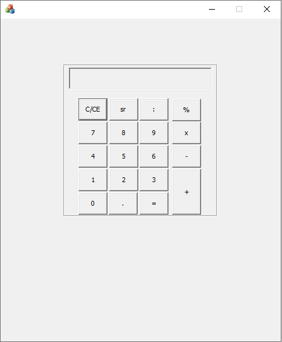

# Calculator Using MFC

A basic calculator application built using **Microsoft Foundation Classes (MFC)** in C++. This project demonstrates the creation of a Windows desktop application with a graphical user interface (GUI) that supports basic arithmetic operations.

## Features

- Addition, subtraction, multiplication, and division
- User-friendly interface with buttons for digits and operations
- Real-time calculation display
- Clear and reset functionality

## Technologies Used

- Microsoft Foundation Classes (MFC)
- C++
- Visual Studio (recommended IDE)

## Getting Started

To build and run the project:

1. Clone this repository.
2. Open the solution file (`.sln`) in Visual Studio.
3. Build the solution.
4. Run the application.

## Screenshot

## License

This project is open-source and available under the [MIT License](LICENSE).